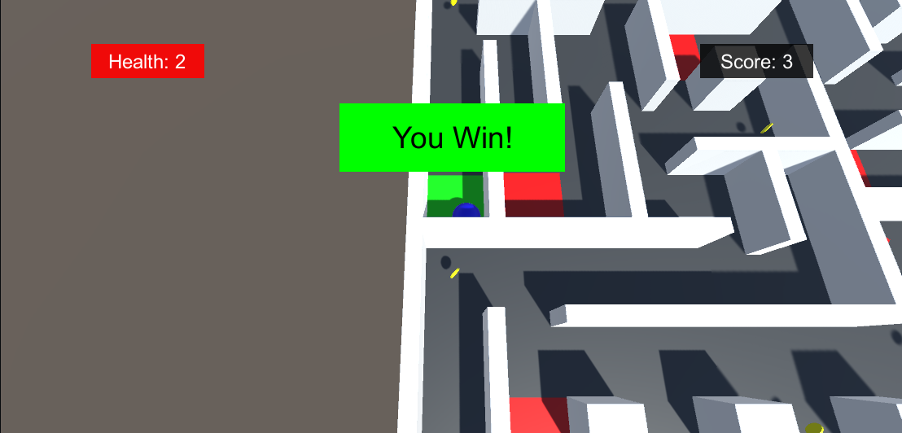

# Unity - UI

## Learning objectives

- What is the Canvas
- What is screen space vs world space
- How to use the Rect Tool
- What are anchors and how to use them
- How to display and update information in the UI
- What is a coroutine
- How to create a menu
- How to use Unity’s UI Interaction Components
- What the alpha value of a color is
- How to set and change material colors with scripts
- What are common accessibility concepts to consider

## How to play

To play this game, you need to move the ball to the green square.

Your player have 5 health points, the red zone makes it lose 1 health.

To complete the game, you, the player, need to go to the green square, while have the maximum score (coins) and not dying.

You can move using arrow keys.

## Visual informations of the project

 

## The Map

 

## Start of the game

 

## The Player

 

## The Coins, +1 to the score

 

## Dangerous Zone, -1 to the health

 

## Win Zone, Win the game

 

## Game is Win

 

## Game is lost

 
